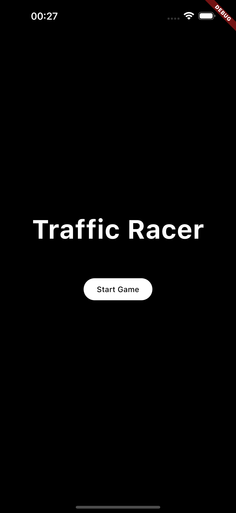
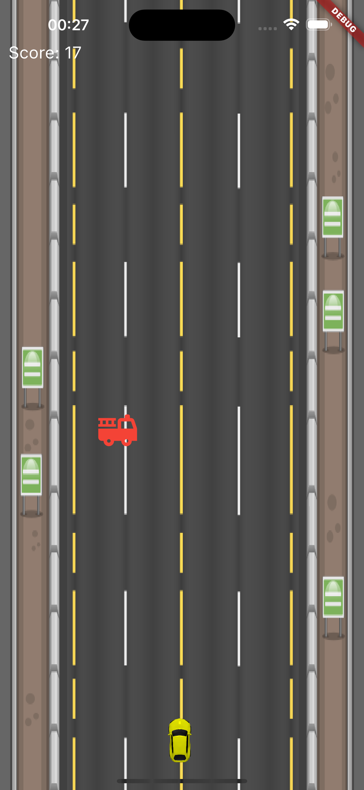
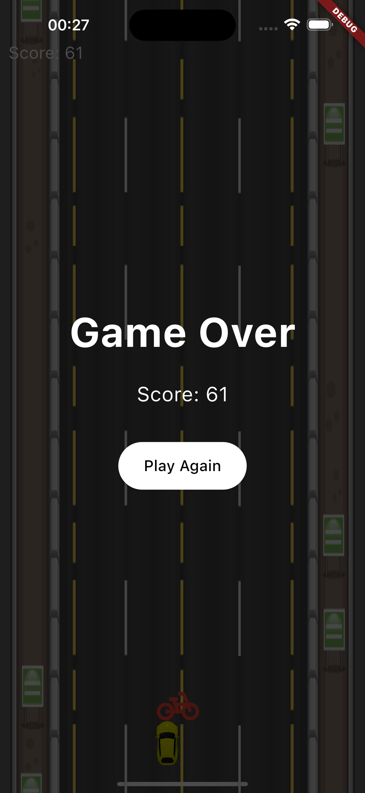

# Traffic Racer

[English](#english) | [Türkçe](#türkçe)

## English

### About the Project

This mobile game is developed using Flutter, offering a fun and engaging experience for users. Use flame_engine for the game engine.

### Screenshots

<table>
  <tr>
    <td></td>
    <td></td>
    <td></td>
  </tr>
</table>

### Getting Started

To run this project locally:

1. Ensure you have Flutter installed
2. Clone this repository
3. Run `flutter pub get` to install dependencies
4. Run `flutter run` to start the app

### Contributing

Contributions are welcome! Please feel free to submit a Pull Request.

---

## Türkçe

### Proje Hakkında

Bu mobil oyun, Flutter kullanılarak geliştirilmiş olup, kullanıcılara eğlenceli ve sürükleyici bir deneyim sunmaktadır. flame_engine kullanılarak geliştirilmiştir.

### Ekran Görüntüleri

<table>
  <tr>
    <td></td>
    <td></td>
    <td></td>
  </tr>
</table>

### Başlangıç

Bu projeyi yerel olarak çalıştırmak için:

1. Flutter'ın yüklü olduğundan emin olun
2. Bu depoyu klonlayın
3. Bağımlılıkları yüklemek için `flutter pub get` komutunu çalıştırın
4. Uygulamayı başlatmak için `flutter run` komutunu çalıştırın

### Katkıda Bulunma

Katkılarınızı bekliyoruz! Lütfen bir Pull Request göndermekten çekinmeyin.

