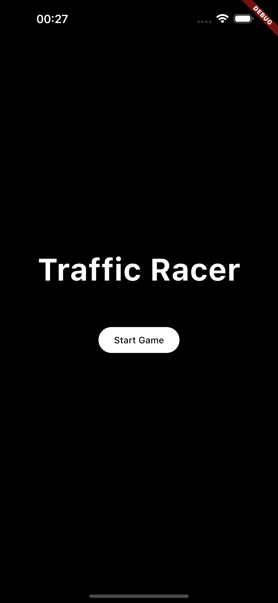
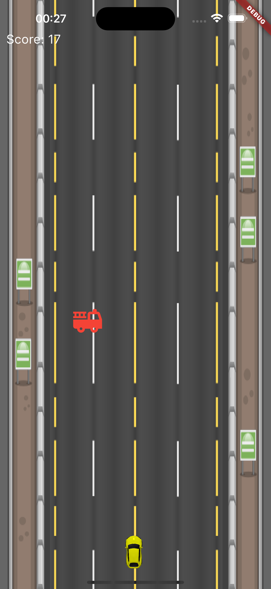
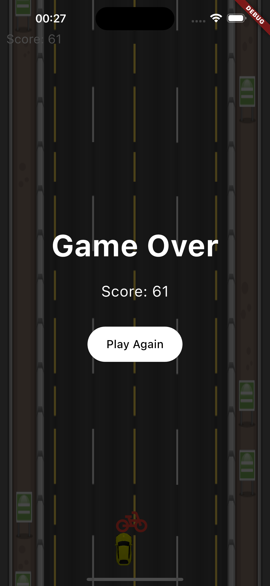

# Traffic Racer

[English](#english) | [Türkçe](#türkçe)

## English

### About the Project

Turbo Traffic Rush is a pseudo-3D arcade traffic racer built with Flutter and the Flame engine. The road is rendered with a classic perspective-segment technique (curves, hills, day/night cycle, distance fog), the cars are drawn procedurally on the canvas, and every sound effect plus the background music loop is synthesised by `scripts/generate_audio.py`.

**Gameplay:** swipe or tap to hop lanes, squeeze past traffic for near-miss combos, collect shield / nitro / 2x / slow-mo power-ups, survive as the traffic gets faster each level. Optional tilt steering, persistent high score.

**Dev notes**
- `flutter test` covers projection math, track generation, scoring, traffic wall-avoidance and an offscreen render of a full run.
- `flutter run --dart-define=TTR_AUTOSTART=true` skips the menu (debug only) for quick QA screenshots.
- Regenerate audio with `python3 scripts/generate_audio.py` (needs numpy).

### Screenshots

<table>
  <tr>
    <td></td>
    <td></td>
    <td></td>
  </tr>
</table>

### Getting Started

To run this project locally:

1. Ensure you have Flutter installed
2. Clone this repository
3. Run `flutter pub get` to install dependencies
4. Run `flutter run` to start the app

### Contributing

Contributions are welcome! Please feel free to submit a Pull Request.

---

## Türkçe

### Proje Hakkında

Bu mobil oyun, Flutter kullanılarak geliştirilmiş olup, kullanıcılara eğlenceli ve sürükleyici bir deneyim sunmaktadır. flame_engine kullanılarak geliştirilmiştir.

### Ekran Görüntüleri

<table>
  <tr>
    <td></td>
    <td></td>
    <td></td>
  </tr>
</table>

### Başlangıç

Bu projeyi yerel olarak çalıştırmak için:

1. Flutter'ın yüklü olduğundan emin olun
2. Bu depoyu klonlayın
3. Bağımlılıkları yüklemek için `flutter pub get` komutunu çalıştırın
4. Uygulamayı başlatmak için `flutter run` komutunu çalıştırın

### Katkıda Bulunma

Katkılarınızı bekliyoruz! Lütfen bir Pull Request göndermekten çekinmeyin.

