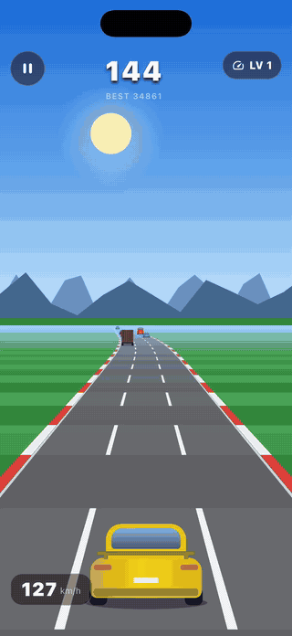
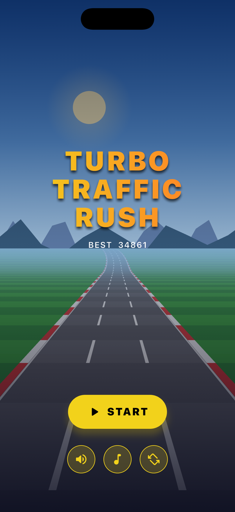
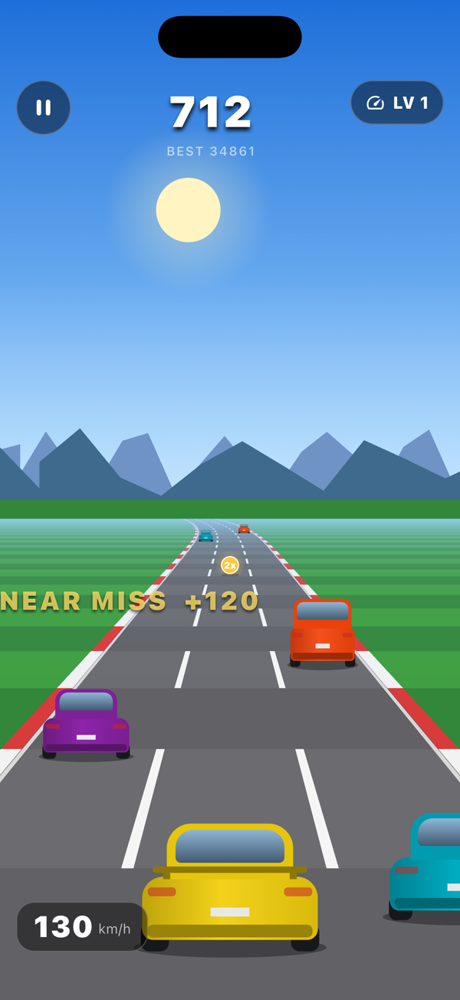
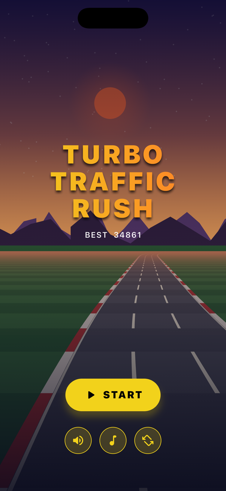

# Turbo Traffic Rush

[English](#english) | [Türkçe](#türkçe)

<p align="center">
  
</p>

<a name="english"></a>
## English

### About

Turbo Traffic Rush is a portrait, pseudo-3D arcade traffic racer built with **Flutter** and the **Flame** engine. There are no sprite sheets or image assets: the road, scenery and every vehicle are drawn procedurally with `Canvas` calls, and every sound effect plus the background music loop is synthesised by a Python script.

### Features

- **Pseudo-3D road** rendered with the classic perspective-segment technique: curves, hills, rumble strips, dashed lanes, distance fog and a parallax mountain backdrop.
- **Day → dusk → night → dawn cycle** that shifts the whole palette as you drive.
- **Procedural traffic** — sedans, hatchbacks, SUVs, vans, trucks and buses with brake lights, drawn at any depth without sprites.
- **Fair traffic AI:** vehicles follow each other and never line up across all three lanes, so there is always a way through.
- **Near-miss combos:** squeeze past a car in the neighbouring lane for bonus points that multiply with each consecutive pass.
- **Power-ups:** Shield (smash through traffic), Nitro (speed + speed lines + exhaust flames), 2x score, Slow-mo.
- **Levels:** every 1500 points the traffic gets faster and denser.
- **Synthesised audio:** pitched engine loop, crash, whoosh, pickups, nitro, level-up fanfare and a synthwave music loop, all generated from `scripts/generate_audio.py`.
- **Controls:** swipe, tap either half of the screen, keyboard (←/→, A/D, Space, P/Esc) or optional **tilt steering**.
- **Persistent best score & distance**, sound / music / tilt toggles, pause and app-lifecycle handling.
- **Daily missions:** three goals per calendar day (deterministic, no server) that pay coins; finish all three for a bonus.
- **Garage & coins:** every run earns coins from distance and near misses; spend them on ten unlockable car bodies and colours, previewed exactly as they look on the road.
- **Turbo Pass:** four exclusive cars with racing details, 2× run coins that stack with streaks, and one free premium-car test drive per calendar day. Racing stays free; mission rewards are unchanged.
- **Consistent simulation:** 120 Hz fixed steps, swept collisions, damped camera and steering lean; equal elapsed time at 15–120 FPS.
- **Daily streak:** consecutive days played multiply coin income (up to +50%).

### Screenshots

<table>
  <tr>
    <td></td>
    <td></td>
    <td></td>
  </tr>
  <tr>
    <td align="center">Menu</td>
    <td align="center">Gameplay</td>
    <td align="center">Game over</td>
  </tr>
</table>

▶ [Watch the gameplay video (mp4)](screenshot/gameplay.mp4)

### How to Play

| Action | Touch | Keyboard |
| --- | --- | --- |
| Change lane | Swipe left/right, or tap the left/right half | ← / → or A / D |
| Pause / resume | Pause button | P or Esc |
| Start / race again | Button | Space or Enter |
| Tilt steering | Enable in the menu, lean the phone | — |

Score grows with distance. Passing a car in the adjacent lane awards a **near miss** bonus; consecutive near misses within ~2.5 s build a combo multiplier. Colliding ends the run unless the Shield is active.

### Getting Started

Requirements: Flutter ≥ 3.44 (Dart ≥ 3.12).

```bash
git clone <this repository>
cd traffic_racer
flutter pub get
flutter run
```

Targets Android and iOS. Tilt steering only appears on real mobile platforms.

### Project Structure

```
lib/
  core/        game_config (tuning constants), projection (camera math), track (procedural looping road)
  entities/    player, traffic_vehicle, power_up_pickup — plain data, no Flame components
  game/        traffic_racer_game (state machine + simulation), traffic_manager, score_keeper,
               power_up_manager, hud_model, progression_coordinator (run hooks → progression)
  progression/ pure Dart: missions, garage/wallet/coin formula, streak
  world/       world_component (one render pass: sky → road → depth-sorted sprites → player → effects),
               sky_painter, vehicle_painter, world_palette, effects
  services/    audio_service, settings_service, high_score_service, tilt_controller,
               missions_service, garage_service, streak_service
  overlays/    menu, hud, pause, game over, garage (Flutter widgets on top of the game)
scripts/       generate_audio.py — regenerates every WAV in assets/audio
test/          projection, track, scoring, traffic wall-avoidance, missions/garage/streak,
               persistence round-trips, overlay layout at phone sizes, offscreen render of a full run
```

### Development

```bash
flutter analyze
flutter test                                          # 47 tests, includes an offscreen render of ~1500 frames
flutter run --dart-define=TTR_AUTOSTART=true          # debug only: skips the menu for quick QA screenshots
python3 scripts/generate_audio.py                     # regenerate all sounds (needs numpy)
```

Gameplay balance lives in `lib/core/game_config.dart` (speeds, lane count, spawn distances, power-up duration, combo window, mission targets and rewards, coin rates, streak cap); car prices are in `lib/progression/car_catalog.dart`. Sounds are generated, not authored: edit the script rather than the WAV files.

### Contributing

Contributions are welcome! Please feel free to submit a Pull Request.

---

<a name="türkçe"></a>
## Türkçe

### Hakkında

Turbo Traffic Rush, **Flutter** ve **Flame** motoruyla geliştirilmiş dikey, pseudo-3D bir arcade trafik yarışıdır. Sprite ya da görsel asset kullanılmaz: yol, manzara ve tüm araçlar `Canvas` çağrılarıyla prosedürel olarak çizilir; tüm ses efektleri ve arka plan müziği bir Python betiğiyle sentezlenir.

### Özellikler

- **Pseudo-3D yol:** klasik perspektif-segment tekniğiyle virajlar, tepeler, bordür şeritleri, kesikli şerit çizgileri, mesafe sisi ve paralaks dağ silueti.
- **Gündüz → akşam → gece → şafak döngüsü:** sürdükçe tüm palet değişir.
- **Prosedürel trafik:** sedan, hatchback, SUV, panelvan, kamyon ve otobüs; fren lambalı, her derinlikte sprite'sız çizilir.
- **Adil trafik yapay zekâsı:** araçlar birbirini takip eder ve üç şeridi aynı anda asla kapatmaz; her zaman bir geçiş vardır.
- **Near-miss kombosu:** yan şeritteki araca sıyırarak geçince bonus; art arda geçişlerde çarpan büyür.
- **Güçlendirmeler:** Kalkan (trafiği ezerek geç), Nitro (hız + hız çizgileri + egzoz alevi), 2x skor, Yavaş çekim.
- **Seviyeler:** her 1500 puanda trafik hızlanır ve yoğunlaşır.
- **Sentezlenmiş ses:** hıza göre tonu değişen motor döngüsü, çarpışma, whoosh, pickup, nitro, seviye fanfarı ve synthwave müzik döngüsü; hepsi `scripts/generate_audio.py` ile üretilir.
- **Kontroller:** kaydırma, ekranın sağ/sol yarısına dokunma, klavye (←/→, A/D, Boşluk, P/Esc) veya isteğe bağlı **eğim (tilt) kontrolü**.
- **Kalıcı en iyi skor ve mesafe**, ses / müzik / tilt anahtarları, duraklatma ve uygulama yaşam döngüsü yönetimi.
- **Günlük görevler:** takvim gününe göre belirlenen (sunucusuz) üç hedef coin öder; üçünü de bitirince bonus.
- **Garaj ve coin:** her tur mesafe ve near-miss'ten coin kazandırır; on farklı açılabilir gövde/renk, yolda göründüğü gibi önizlenir.
- **Turbo Pass:** yarış detaylı dört özel araç, seri bonusuyla birleşen 2× tur coin kazancı ve her takvim günü bir ücretsiz premium araç test sürüşü. Yarış ücretsiz kalır; görev ödülleri değişmez.
- **Tutarlı simülasyon:** 120 Hz sabit adım, hareket boyunca çarpışma kontrolü, yumuşak kamera takibi ve direksiyon eğimi; 15–120 FPS arasında aynı oyun süresi.
- **Günlük seri:** art arda oynanan günler coin kazancını çarpar (en fazla +%50).

### Ekran Görüntüleri

<table>
  <tr>
    <td></td>
    <td></td>
    <td></td>
  </tr>
  <tr>
    <td align="center">Menü</td>
    <td align="center">Oynanış</td>
    <td align="center">Oyun sonu</td>
  </tr>
</table>

▶ [Oynanış videosunu izle (mp4)](screenshot/gameplay.mp4)

### Nasıl Oynanır

| Eylem | Dokunmatik | Klavye |
| --- | --- | --- |
| Şerit değiştir | Sola/sağa kaydır veya sol/sağ yarıya dokun | ← / → veya A / D |
| Duraklat / devam | Duraklat düğmesi | P veya Esc |
| Başlat / tekrar yarış | Düğme | Boşluk veya Enter |
| Eğim kontrolü | Menüden aç, telefonu yatır | — |

Skor mesafeyle artar. Yan şeritteki bir aracı geçmek **near miss** bonusu verir; ~2,5 sn içinde art arda near miss'ler kombo çarpanını büyütür. Çarpışma, Kalkan aktif değilse turu bitirir.

### Başlangıç

Gereksinim: Flutter ≥ 3.44 (Dart ≥ 3.12).

```bash
git clone <bu depo>
cd traffic_racer
flutter pub get
flutter run
```

Android ve iOS hedeflenir. Eğim kontrolü yalnızca gerçek mobil platformlarda görünür.

### Proje Yapısı

```
lib/
  core/        game_config (ayar sabitleri), projection (kamera matematiği), track (prosedürel döngüsel yol)
  entities/    player, traffic_vehicle, power_up_pickup — Flame bileşeni değil, saf veri
  game/        traffic_racer_game (durum makinesi + simülasyon), traffic_manager, score_keeper,
               power_up_manager, hud_model, progression_coordinator (tur kancaları → ilerleme katmanı)
  progression/ saf Dart: görevler, garaj/cüzdan/coin formülü, seri
  world/       world_component (tek çizim geçişi: gökyüzü → yol → derinlik sıralı sprite'lar → oyuncu → efektler),
               sky_painter, vehicle_painter, world_palette, effects
  services/    audio_service, settings_service, high_score_service, tilt_controller,
               missions_service, garage_service, streak_service
  overlays/    menü, HUD, duraklatma, oyun sonu, garaj (oyunun üstündeki Flutter widget'ları)
scripts/       generate_audio.py — assets/audio içindeki tüm WAV'ları yeniden üretir
test/          projeksiyon, pist, skor, trafik duvar-önleme, görev/garaj/seri mantığı,
               kalıcılık, telefon boyutlarında overlay yerleşimi, tam bir turun ekran dışı render'ı
```

### Geliştirme

```bash
flutter analyze
flutter test                                          # 47 test; ~1500 karelik ekran dışı render dahil
flutter run --dart-define=TTR_AUTOSTART=true          # yalnızca debug: hızlı QA görüntüsü için menüyü atlar
python3 scripts/generate_audio.py                     # tüm sesleri yeniden üret (numpy gerekir)
```

Oynanış dengesi `lib/core/game_config.dart` içindedir (hızlar, şerit sayısı, spawn mesafeleri, güçlendirme süresi, kombo penceresi, görev hedefleri ve ödülleri, coin oranları, seri tavanı); araba fiyatları `lib/progression/car_catalog.dart` içindedir. Sesler üretilir, elle hazırlanmaz: WAV'ları değil betiği düzenleyin.

### Katkıda Bulunma

Katkılarınızı bekliyoruz! Lütfen bir Pull Request göndermekten çekinmeyin.
